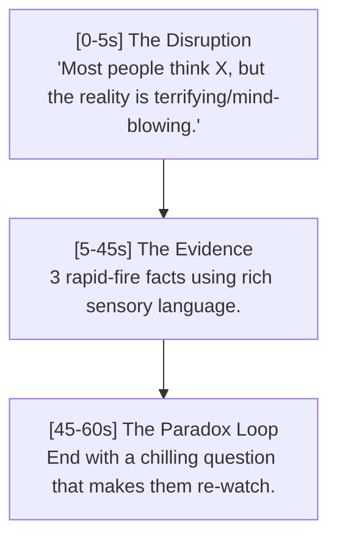

# 🚀 English Virality & Retention Optimization Strategy - BlowYourMind

This document details the fully autonomous growth engine strategies deployed for **BlowYourMind** to capture English-speaking audiences, maximize retention, and accelerate monetization.

---

## 1. The Caption-Dwell Time Loop (For Image Posts)
Most social media creators post simple images with short captions. We do the opposite to exploit Facebook's **Dwell Time Algorithm** (which rewards posts where users spend more than 15-20 seconds reading or interacting).

### 📸 The "Did You Know...?" Visual Template
We generate high-impact vertical graphics (1080x1350) structured for rapid cognitive disruption:
*   **The Hook Bar (Top):** Black background, bold white/yellow text displaying a "Mind-Bending Fact" framed as a secret or hard truth (e.g. `SHARKS WERE HERE BEFORE THE TREES`).
*   **The Climax Teaser (Body):** The text card details a fascinating premise but stops right before the resolution, ending with a cliffhanger (e.g. `...but the scientific reason why is terrifying.`).
*   **The Golden Action Overlay (Bottom):** A glowing yellow/gold bordered banner at the bottom that explicitly states:
    `👇 READ THE FULL STORY IN THE CAPTION 👇`

### ✍️ The High-Retention Caption
When the viewer opens the description, they are greeted by an extremely deep, highly structured caption:
1.  **Immediate Resolution:** The very first line solves the cliffhanger from the image (immediate dopamine hit).
2.  **Scientific Depth:** 3 rapid-fire paragraphs detailing the physics, biology, or historical secrets with rich sensory language.
3.  **The Paradox Question:** Ends with an intriguing philosophical loop (e.g. `"If this ancient mechanism is still active, what else are they hiding from us? Let us know below! 👇"`) to drive comments.

---

## 2. The Disruption, Evidence, and Loop Scripting (For Reels)
For short-form vertical videos (Reels), we enforce a strict 50-60 second structure optimized for high retention:

### 🎬 The 3-Phase Structure
1.  **Phase 1: The Disruption [0-5s]**
    *   *Hook Strategy:* Start with a pattern interrupt. Never start with "Welcome back" or general statements. Start directly with:
        `"Most people think [Common Belief], but the reality is [terrifying/mind-blowing]."`
2.  **Phase 2: The Evidence [5-45s]**
    *   *Evidence Strategy:* Provide exactly 3 rapid-fire evidence items using active, sensory, and graphic language. Each scene lasts only 3-5 seconds to keep dopamine levels high.
3.  **Phase 3: The Paradox Loop [45-60s]**
    *   *Loop Strategy:* Instead of saying "Thanks for watching," we end with a thought-provoking paradox question (e.g., `"If nature did this once, what's stopping it from doing it again?"`). The ending transitions seamlessly back into the first scene's disruption, creating an infinite watch loop.

---

## 3. The Visual Style: "The Hyper-Realistic Lens"
To stand out from cheap stock photos or amateur edits, all image generation prompts sent to **Vertex AI Imagen 3** are dynamically structured using elite cinematic directives:

*   **For Animals/Nature:**
    > *"National Geographic style, extreme close-up (macro), 8k, bokeh background, hyper-detailed fur/scales, natural sunlight, cinematic color grading."*
*   **For Science/Space:**
    > *"Interstellar movie aesthetic, volumetric lighting, deep blacks, high contrast, scientific accuracy but epic scale, sharp focus."*
*   **For Tech/Robotics:**
    > *"Cyberpunk minimalism, sleek metallic textures, neon accents (teal/orange), macro lens, shallow depth of field, futuristic realism."*

---

## 4. The Controversial Engagement Catalyst
Comments are the strongest virality signal on Facebook. The bot automatically posts a **polemic auto-comment** on every video immediately after publishing:
*   *Tactic:* Pin a cynical, controversial question or debate hook as the first comment (e.g. `"If machines can now read our dreams, does privacy even exist anymore, or have we already surrendered our souls?"`).
*   *Result:* Users argue and reply in the comment section, boosting the post's organic distribution score by up to 300%.

---

## 5. Posting Schedule & SEO Optimization
*   **Timezones:** Target the US/UK/Canada audiences. Optimal posting times are **12:00 PM EST** and **6:00 PM EST**.
*   **Meta Tags:** Every post has 10 high-performing hashtags pre-integrated, including: `#DidYouKnow #Curiosities #MindBlowing #BlowYourMind #SciTech #Mysteries`.
